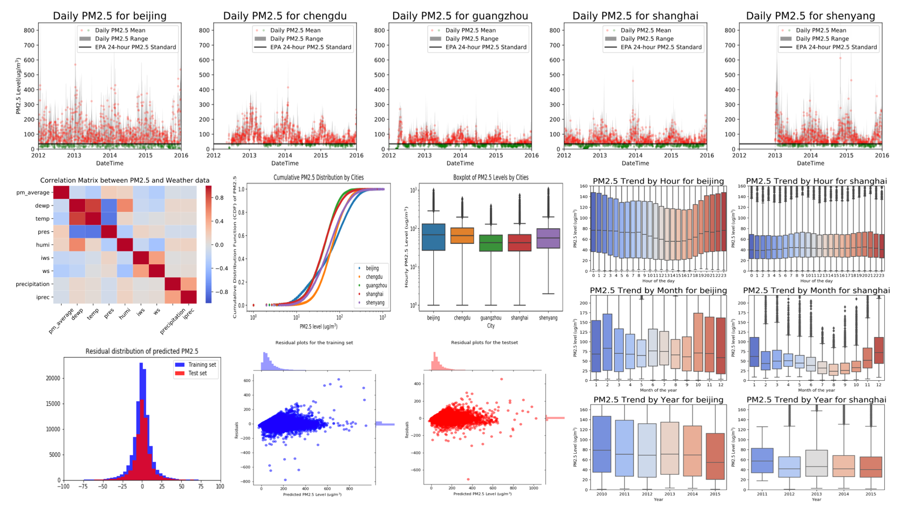

# Air Quality Prediction for Major Cities of China

## Executive Summary

Understanding and predicting air pollution have become increasingly important to people at all levels in China over the past few years. Hourly PM2.5 data of five major Chinese cities in the period of 2010-2015 are acquired, analyzed and modeled in this project, to identify PM2.5 patterns and forecast future air quality: 

### * PM2.5 Patterns

Alters siginificantly among cities: air quality rankings from the best to the worse are Guangzhou, Shanghai, Chengdu and Shenyang, Beijing. Unfortunately, PM2.5 levels for all five cities are too high to be considered healthy and safe according to EPA standards. 
Varies systematically with hour of the day, month of the year and from year to year: daily and monthly trends are unique for individual cities, whereas yearly trend from 2010 to 2015 shows a consistent improvement in all cities, but the improvement is only moderate. 
Correlates with meteorological weather data to some extent: both high winds and large precipitations help to improve air quality in all cities; wind direction also affect air quality, but the impact differs by city, as determined by city location and neighbour environment; air quality are positively correlated to temperature and dew point, but negatively correlated to pressure and humidity. 

### Click here for an interactive visualization of [Air Quality Variation by City](https://public.tableau.com/views/airqualitybycity/Dashboard1?:embed=y&:display_count=yes&publish=yes) in *Tableau*

### * Modeling PM2.5

Modeling and predicting air quality (PM2.5) is a complex problem, as there are many underlying factors all playing an role in shaping PM2.5. As revealed, both historical values, datetime and various weather conditions all have impacts on future PM2.5 values. As the winning model suggests, historical value is crucial in setting the baseline of the next step, and various meteorological weather conditions as well as datetime features determines how PM2.5 value in the next step deviates from its previous step. The optimized model not only forecasts into the future, but also extends to predict an unseen city, achieving  R2R2  of 0.94 and MSE of 253 (RMSE of 16). In comparison, the average PM2.5 of the dataset is 73.9 ± 68.8.

## Further Readings
Link to the full report: 
https://github.com/jingzhaomirror/capstone1_air_quality_prediction/blob/master/final_report.ipynb
 
Link to the ppt slide deck:  
https://github.com/jingzhaomirror/capstone1_air_quality_prediction/blob/master/slide_deck.pdf
 
